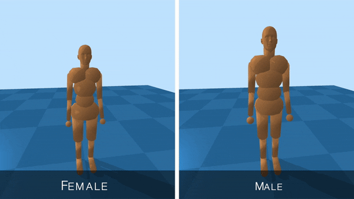
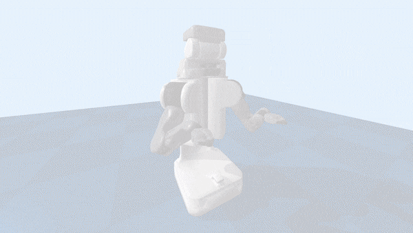

# Assistive Gym

Assistive Gym is a physics-based simulation framework for physical human-robot interaction and robotic assistance.

Assistive Gym is integrated into the OpenAI Gym interface, enabling the use of existing reinforcement learning and control algorithms to teach robots how to interact with people. 


### Paper
A paper on Assistive Gym can be found at https://arxiv.org/abs/1910.04700
```
@article{erickson2019assistivegym,
  title={Assistive Gym: A Physics Simulation Framework for Assistive Robotics},
  author={Erickson, Zackory and Gangaram, Vamsee and Kapusta, Ariel and Liu, C. Karen and Kemp, Charles C.},
  journal={arXiv preprint arXiv:1910.04700},
  year={2019}
}
```

## Install
### Simple installation using a python virtual environment.
We encourage installing Assistive Gym and the custom PyBullet engine in a python virtualenv.  
A detailed description of each installation step can be found in the [Install Guide](https://github.com/Healthcare-Robotics/assistive-gym/wiki/1.-Install).
```bash
python3 -m pip install --user virtualenv
python3 -m venv env
source env/bin/activate
pip3 install git+https://github.com/Zackory/bullet3.git
git clone https://github.com/Healthcare-Robotics/assistive-gym.git
cd assistive-gym
pip3 install .
# Leave virtual env with: deactivate
```

## Getting Started
We provide a [10 Minute Getting Started Guide](https://github.com/Healthcare-Robotics/assistive-gym/wiki/3.-Getting-Started) to help you get familiar with using Assistive Gym for assistive robotics research.

You can visualize the various Assistive Gym environments using the environment viewer.  
A full list of available environment can be found [Here (Environments)](https://github.com/Healthcare-Robotics/assistive-gym/wiki/2.-Environments).
```bash
python3 env_viewer.py --env "FeedingJaco-v0"
```

We provide pretrained control policies for each robot and assistive task.  
See [Running Pretrained Policies](https://github.com/Healthcare-Robotics/assistive-gym/wiki/4.-Running-Pretrained-Policies) for details on how to run a pretrained policy.

See [Training New Policies](https://github.com/Healthcare-Robotics/assistive-gym/wiki/5.-Training-New-Policies) for documentation on how to train new control policies for Assistive Gym environments.

Finally, [Creating a New Assistive Environment](https://github.com/Healthcare-Robotics/assistive-gym/wiki/6.-Creating-a-New-Assistive-Environment) discusses the process of creating an Assistive Gym environment for your own human-robot interaction tasks.

## Features
### Human and robot models 
Customizable female and male human models (default body sizes and weights matching 50th percentile humans).  
40 actuated human joints (head, torso, arms, waist, and legs)  
&nbsp;  
  
&nbsp;  
Four collaborative robots (PR2, Jaco, Baxter, Sawyer).  
&nbsp;  

### Realistic human joint limits
Building off of prior research, Assistive Gym provides a model for realistic pose-dependent human joint limits.  
&nbsp;  

### Robot base pose optimization
A robot's base pose can greatly impact the robot’s ability to physically assist people.  
We provide a baseline method using joint-limit-weighted kinematic isotopy (JLWKI) to select good base poses near a person.  
With JLWKI, the robot chooses base poses (position and yaw orientation) with high manipulability near end effector goals.  
&nbsp;  

### Human preferences
During assistance, a person will typically prefer for the robot not to spill water on them, or apply large forces to their body.  
Assistive Gym provides a baseline set of human preferences unified across all tasks, which are incorporated directly into the reward function.
This allows robots to learn to provide assistance that is consist with a person's preferences.  
&nbsp;  


Refer to [the paper](https://arxiv.org/abs/1910.04700) for details on features in Assistive Gym.
